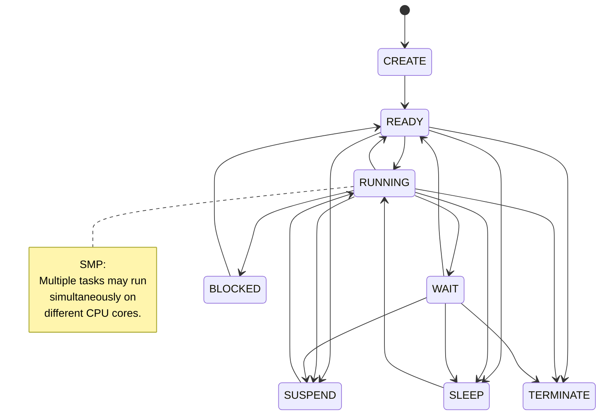

# ARX™ - Advanced Realtime Xecutables

**ARX™** is a proprietary, deterministic real-time operating system (RTOS) designed for embedded systems and performance-critical systems.  
It is built from first principles with a focus on predictability, low overhead, and architectural clarity.

## Supported Architectures  
* **ARM**
    * **ARM32:** Support for legacy and deterministic M/R-profile cores.
    * **ARM64:** High-performance 64-bit support (v8-A/R architectures).
* **RISC-V**
    * **RISC-V 32:** Optimized for resource-constrained microcontrollers and IoT devices.
    * **RISC-V 64:** Support for a wide range of RISC-V 64-bit cores.
    
## Key Features
* **Deterministic Scheduler:** Priority-based preemptive scheduling.
* **Dual-License Model:** GPLv3 for community use; Commercial for proprietary products.
* **Lightweight:** Designed for memory-constrained environments (MPU-ready).
* **Developer Efficiency:** Engineered for simplicity—lowering effort, cost, and time-to-market.

## ARX Status
- Active development (core implementation is private).

## SDK & Distribution
- The ARX SDK implementation is maintained in a private repository.
- This public repository provides documentation, architectural overviews, and project information.
- Prebuilt demo binaries are distributed through this repository.
  
## Roadmap
Prebuilt demonstration binaries are being added progressively to help users quickly evaluate ARX RTOS features,  
platform bring-up, and kernel capabilities.  
Current planned demonstration coverage includes:

---

### 1.0 ARX Boot Process
#### Overview
This demo validates the ARX boot sequence, tracing execution from platform reset through low-level hardware initialization, kernel startup, device driver initialization, task creation, and the transition to scheduler runtime.

| Attribute | Details |
| :--- | :--- |
| **Executable** | `[platform][boot][arxos.bin]` |
| **Architecture** | RV64                        |
| **Platform**     | SHAKTI-C (QEMU), VIRT       |
| **Location** | `arxos/arch/<arch>/<cpu_variant>/<platform>` |
| **Status** | ✅ Available |
| **Demo Video** |*Uploading Soon* |

#### Sequence & Initialization Phases
The system startup sequence executes in a defined order to ensure that the hardware platform, memory subsystem, kernel services, and device drivers are fully initialized before multitasking begins.

#### Key Features Demonstrated
* **Platform/BSP Initialization:** Verifies bootstrap entry points, processor setup, and platform-specific hardware initialization.
* **Memory Initialization:** Safe partitioning and initialization of RAM segments, vector table positioning, and runtime memory boundaries.
* **Kernel Startup:** Initializes core kernel data structures and management services.
* **Device Driver Initialization:** Brings up essential platform peripherals such as system timers and UART interfaces.
* **User Task Creation:** Instantiation of the initial root task topologies into the execution pool.
* **Scheduler Activation:** Starts the scheduler and performs the first task dispatch.

#### Expected Behavior
Upon power-on or platform reset, the binary processes all early Board Support Package (BSP) dependencies linearly. Once memory architectures and necessary system device drivers are online, ARX instantiates the predefined base tasks, initializes the core kernel state, and hands off execution control directly to the hardware-managed scheduler. 
A clean, predictable logs stream will output to the diagnostic console, tracking each initialization phase without faults or unexpected processor exceptions.

---

### 2.0 New Task Creation
#### Overview
This demo validates the ARX kernel's lifecycle mechanisms for task creation, stack initialization, and seamless integration into the active scheduler run-queues.

| Attribute | Details |
| :--- | :--- |
| **Executable** | `[platform][newp][arxos.bin]` |
| **Architecture** | RV64                        |
| **Platform**     | SHAKTI-C (QEMU), VIRT       |
| **Location** | `arxos/arch/<arch>/<cpu_variant>/<platform>` |
| **Status** | ✅ Available |
| **Demo Video** |*Uploading Soon* |

#### Task Characterization & Constraints
The system instantiates four distinct tasks configured with strict execution budgets, periods, and deadlines to verify real-time scheduling alignment:

| Task ID | WCET | Release Period | Deadline | Priority |
| :--- | :---: | :---: | :---: | :---: |
| **Task-1** | `2` | `5` | `3` | `0` |
| **Task-2** | `2` | `10` | `5` | `1` |
| **Task-3** | `2` | `20` | `7` | `2` |
| **Task-4** | `2` | `40` | `9` | `3` |

> **Note on Priorities:** Priority assignment follows standard kernel configuration metrics, where lower numerical values represent higher urgency/dominance during execution arbitration.

#### Key Features Demonstrated
* **Static Task Creation:** Allocation of core task control blocks (TCBs) during system initialization phase.
* **Stack Allocation:** Proper alignment and initialization of isolated execution stacks.
* **Priority Assignment:** Correct configuration of scheduling bands across multiple independent contexts.
* **Scheduler Insertion:** Immediate migration of initialized tasks into the ready queue structures.
* **Task Startup:** Successful context switching into the entry point functions of freshly spawned tasks.

#### Expected Behavior
Upon initialization, the ARX kernel parses the defined task topology, prepares the runtime context for each task instance, and registers them with the scheduling engine. Tasks execute deterministically according to their defined metrics, meeting operational deadlines under strict priority-based preemption constraints.

---

### 3.0 Scheduling Behavior
#### Overview
This demo validates the ARX kernel's deterministic, fixed-priority preemptive scheduling engine under heavy concurrent execution workloads, proving its ability to guarantee immediate execution of high-priority tasks.

| Attribute | Details |
| :--- | :--- |
| **Executable** | `[platform][scheduler][arxos.bin]` |
| **Architecture** | RV64                        |
| **Platform**     | SHAKTI-C (QEMU)             |
| **Location** | `arxos/arch/<arch>/<cpu_variant>/<platform>` |
| **Status** | Planned / Upload Pending |
| **Demo Video** | *Uploading Soon* |

#### Key Features Demonstrated
* **Strict Priority Scheduling:** Validation of the kernel's execution selection based entirely on assigned task dominance metrics.
* **Low-Latency Task Preemption:** Instant suspension of lower-priority contexts the moment a higher-priority task transitions into the ready queue.
* **Real-Time Execution Trackability:** Execution of multiple independent loops to track deterministic timeline jitter and scheduling boundaries.
* **Deterministic Scheduling:** Ensuring that ready queue sorting and context-switching latencies remain constant regardless of the number of registered tasks.
* **Runtime Task Management:** Smooth state transitions (`RUNNING`, `READY`, `BLOCKED`) during heavy asynchronous event injections.

#### Expected Behavior
When multiple tasks are ready to run, the ARX scheduling engine assigns the CPU exclusively to the task with the highest priority configuration. If a high-priority task unblocks (due to a timer tick, semaphore release, or hardware interrupt), the kernel executes a low-latency context switch, preempting the lower-priority thread instantly. 
The lower-priority task is safely preserved in the ready queue and resumes execution only when all higher-priority threads relinquish the processor, demonstrating absolute adherence to real-time execution bounds.

---

### 4.0 Task State Transition
#### Overview
This demo validates the ARX kernel's task lifecycle management infrastructure, proving the integrity of the state machine as tasks transition dynamically through scheduler-driven execution modes based on timing, synchronization events, and explicit kernel requests.

| Attribute | Details |
| :--- | :--- |
| **Executable** | `[platform][state][arxos.bin]` |
| **Architecture** | RV64                        |
| **Platform**     | SHAKTI-C (QEMU)             |
| **Location** | `arxos/arch/<arch>/<cpu_variant>/<platform>` |
| **Status** | Planned / Upload Pending |
| **Demo Video** | *Uploading Soon* |

## Task State Model

The ARX scheduler manages task execution through the following lifecycle:



#### Key Features Demonstrated
* **Running & Ready States:** Proper allocation of the CPU to the highest-priority target task, and immediate queue re-insertion when a task is yielded or preempted.
* **Blocked State:** Orderly relocation of a task from the active ready queue to a resource-specific wait queue upon encountering a locked primitive or missing dependency.
* **Suspended (Limited vs. Unlimited Period):** Validating time-bounded suspension hooks (e.g., timed delays) alongside absolute, open-ended suspensions requiring an explicit external resume wake-up call.
* **Sleep (Unlimited Period):** Verification of low-power or deep-sleep dormant configurations where the task context is cleanly shelved without taxing scheduler tracking overhead.
* **WAITING Transition Handling:** Ensuring robust internal kernel arbitration when a task is waiting on multiple compounding constraints simultaneously.
* **Termination State:** Secure de-allocation of TCB parameters, stack recovery, and structural cleanup when a task reaches its exit instruction.

#### Expected Behavior
The demo orchestrates a controlled suite of task operations that force target threads through every stage of the lifecycle state machine. The ARX kernel manipulates task control flags and ready bitmaps without dropping contexts or leaving hanging pointer definitions. 
Tasks enter, wait, wake up, and terminate in perfect synchronicity with environmental stimulus, showing no memory leakage or priority queue corruption during heavy state churn.

---

### 5.0 Stack Overflow Detection
#### Overview
This demo validates the ARX kernel's stack overflow detection and active runtime protection mechanisms, proving the system's ability to trap illegal stack growth before it corrupts adjacent task contexts or critical kernel memory spaces.

| Attribute | Details |
| :--- | :--- |
| **Executable** | `[platform][spovf][arxos.bin]` |
| **Architecture** | RV64                        |
| **Platform**     | SHAKTI-C (QEMU)             |
| **Location** | `arxos/arch/<arch>/<cpu_variant>/<platform>` |
| **Status** | ✅ Available |
| **Demo Video** | *Uploading Soon* |

#### Architectural Stack Protection Models
The kernel implements robust containment boundaries to trap out-of-bounds stack pointer mutations dynamically:  
Method A: Hardware-Enforced MPU Region Guard  
Method B: Software Stack Canary Monitoring

#### Key Features Demonstrated
* **Active Stack Monitoring:** Continuous or context-switch-driven validation of task-specific stack allocation allocations.
* **Hardware/Software Overflow Detection:** Utilization of Memory Protection Unit (MPU) alignment boundaries or magic-number canary tracking to catch out-of-bounds stack frames.
* **Proactive Fault Isolation:** Immediately halting the offending execution context before it modifies neighboring TCBs or application data memory.
* **Overflow Reporting & Diagnostics:** Generation of diagnostic stack-trace info, register snapshots, and tracking logs over the serial console upon fault capture.

#### Expected Behavior
The demo application intentionally forces a target task to execute deep recursive calls or allocate large arrays locally, exhausting its allocated stack limit. The moment the stack pointer crosses the safe operational threshold(80%), ARX intercepts the violation via a hardware exception (MPU fault) or a software guard check. 
Rather than allowing an uncontrolled system crash or memory corruption, the kernel safely isolates the faulty task, preserves general system stability, and emits an explicit stack overflow warning message to the diagnostic terminal.

---
 
### 6.0 ARX Tasks Cluster Formation

#### Overview
This demo validates the ARX real-time task clustering infrastructure. It demonstrates the framework's ability to dynamically aggregate multiple independent real-time execution threads into a unified, synchronized processing group to achieve a collective execution goal with deterministic boundaries.

| Attribute | Details |
| :--- | :--- |
| **Executable** | `[platform][clust][arxos.bin]` |
| **Architecture** | RISC-V (RV64) |
| **Platform** | SHAKTI-C (QEMU) |
| **Location** | `arxos/arch/riscv/shakti_c/qemu` |
| **Status** | Planned / Upload Pending |
| **Demo Video** | *Uploading Soon* |

#### Task Aggregation Topology

```c
                      ┌───────┐
                   ┌─►│Task TA├─┐
                   │  └───────┘ │
[Hardware]   ┌─────┴──────────┐ │   ┌───────────────┐
Resources ──►│ARX Group Layer ├─┼──►│Collective Goal│
             └─────┬──────────┘ │   └───────────────┘
                   │  ┌───────┐ │   [Barrier Release]
                   ├─►│Task TB├─┤
                   │  └───────┘ │
                   │  ┌───────┐ │
                   └─►│Task TC├─┘
                      └───────┘
```

#### Key Features Demonstrated
Static Group Aggregation: Programmatic clustering of discrete RTOS tasks into bounded execution domains without modifying individual kernel task control blocks (TCBs).
Coordinated Resource Budgeting: Enforcing shared memory, MPU boundaries, and CPU time-slice budgets across all member tasks within a designated group.
Deterministic Barrier Synchronization: Utilizing low-overhead hardware/software primitives to ensure all aggregated tasks reach collective execution checkpoints simultaneously.
Priority Inter-Inheritance: Preventing priority inversion across clusters by ensuring the group's real-time urgency context scales dynamically based on localized workload strains.
Jitter Elimination: Verifying that grouped execution transitions eliminate inter-task scheduling jitter during parallel real-time calculations.

#### Expected Behavior
Upon subsystem initialization, the ARX kernel spawns multiple independent task vectors and assigns them to a single structured execution cluster.
The console output will show these tasks coordinating to solve a single processing target. Rather than executing in a scattered, interleaved fashion, the tasks will use the group formation layer to synchronize their steps perfectly. You will see clean, aligned logs showing group registration, balanced workload distribution across the task slices, barrier arrival timestamps matching down to the exact clock cycle, and clean group de-allocation once the collective execution goal is met.

---

### 7.0 CMD Execution Infrastructure
#### Overview
This demo validates the ARX Command (CMD) execution infrastructure by simulating a high-throughput Solid-State Drive (SSD) workload profile. 
The infrastructure processes concurrent operational requests divided into four distinct transaction categories modeled directly after the NVMe standard architecture.

| Attribute | Details |
| :--- | :--- |
| **Executable** | `[platform][cmdinfra][arxos.bin]` |
| **Architecture** | RISC-V (RV64IMAC) |
| **Platform** | SHAKTI-C (QEMU) |
| **Location** | `arxos/arch/riscv/shakti_c/qemu` |
| **Status** | ✅ Available |
| **Demo Video** | *Uploading Soon* |

#### Task and Execution Allocation Matrix
The firmware employs a dedicated 16-task execution model that enforces strict separation between high-throughput data-path processing and asynchronous system management activities.

| Context | Tasks | Core Domain | Scheduling |
| :--- | :--- | :--- | :--- |
| **PCIe Host Interface** | `T0` – `T7` *(8x)* | NVMe Command Processing (Admin, Read, Write, Erase) | Continuous / Line-Rate |
| **Supervisor & Recovery** | `H0` – `H7` *(8x)* | Fault Handling, Queue Recovery, Error Correction | Asynchronous / Event-Driven |

This partitioning ensures that latency-sensitive host I/O processing remains isolated from background recovery and supervisory functions, preserving deterministic performance while enabling robust fault management.

#### Sample Console Output
```console
ARX Functional Report:
BSRC Report: Shut Downs:10251  Soft Reset:0  Force Idle:0  Resumed:1477  Timeouts:8776
System Stack Used:%(N/A)
Processing power saved:%(N/A)
System up-time since last reboot   36 :  20 :   0
PID STS CLS TSL FLT PWM   EVENTS   RSCHDREQ      RELNQ PRE-EMPTD SUSP-LTD  SUSP-ULTD   RESUME    SLEEP   WAKSUP    BLOCK    NOBLK  EXITINLK  SYSCALL    SCHDSEL      TSEXP WDGA    Hart0      STK USED(%)
  0 IDL BGD   2   0   0        0          0          0         0        0         0         0        0        0        0        0         0        0    9500221          0  0    9500221      64
  1 RDY FED   2   0   0        0          0       4215         0        0         0         0        0        0        0        0         0        0   11192839   11188623  0   11192839      55
  2 RDY FED   2   0   0        0          0       5365         0        0         0         0        0        0        0        0         0        0   11192839   11187473  0   11192839      55
  3 RDY FED   2   0   0        0          0       4639         0        0         0         0        0        0        0        0         0        0   11192839   11188200  0   11192839      55
  4 RDY FED   2   0   0        0          0       4852         0        0         0         0        0        0        0        0         0        0   11192839   11187987  0   11192839      55
  5 RDY FED   2   0   0        0          0   11192725         0        0         0         0        0        0        0        0         0        0   11192839        113  0   11192839      54
  6 RDY FED   2   0   0        0          0   11192778         0        0         0         0        0        0        0        0         0        0   11192839         60  0   11192839      54
  7 RDY FED   2   0   0        0          0   11192784         0        0         0         0        0        0        0        0         0        0   11192839         54  0   11192839      32
  8 RDY FED   2   0   0        0          0   11192771         0        0         0         0        0        0        0        0         0        0   11192839         67  0   11192839      54
  9 RDY FED   4   0   0        0          0   11191274         0        0         0         0        0        0        0        0      4502        0   11197341       6066  0   11197341      67
 10 RDY FED   4   0   0        0          0   11191188         0        0         0         0        0        0        0        0      4526        0   11197365       6176  0   11197365      86
 11 RDY FED   4   0   0        0          0   11191207         0        0         0         0        0        0        0        0      4491        0   11197330       6122  0   11197330      67
 12 RDY FED   4   0   0        0          0   11191203         0        0         0         0        0        0        0        0      4525        0   11197364       6160  0   11197364      65
 13 RDY FED   4   0   0        0          0   11191199         0        0         0         0        0        0        0        0      4499        0   11197338       6138  0   11197338      65
 14 RDY FED   4   0   0        0          0   11191152         0        0         0         0        0        0        0        0      4457        0   11197296       6143  0   11197296      67
 15 RDY FED   4   0   0        0          0   11191136         0        0         0         0        0        0        0        0      4840        0   11197679       6542  0   11197679      64
 16 RDY FED   4   0   0        0          0   11190874         0        0         0         0        0        0        0        0      4622        0   11197461       6586  0   11197461      65
---------------------------------------------
Illegal CMDs:17308
Decoding Failed:1402576
Corrected(ERR Task):104056
Corrected(Fault Handler):9933750
ERR(RD Build):4264  Corrected(RD CMD): 2508852  ERR In Exec(RD CMD):    2492  RD CMD Executed:1952253918  RD CMD RCVD:1952615325
ERR(WR Build):4361  Corrected(WR CMD): 2510560  ERR In Exec(WR CMD):    2495  WR CMD Executed:1952253721  WR CMD RCVD:1952615325
ERR(ER Build):4405  Corrected(ER CMD): 2511662  ERR In Exec(ER CMD):    2525  ER CMD Executed:1952253449  ER CMD RCVD:1952615325
ERR(AD Build):4194  Corrected(AD CMD): 2506732  ERR In Exec(AD CMD):    2552  AD CMD Executed:1952253040  AD CMD RCVD:1952615325
All RWEA CMDs are processed
----------------------------------------------------------------------------------------------------------------------------
```

#### Key Features Demonstrated
* **Admin Command Arbitration:** Execution of initialization, structural discovery, capabilities tracking, and queue management protocols mimicking NVMe Admin Submission queues.
* **Block I/O Read Pipeline:** Low-latency parsing and memory allocation for non-blocking read arrays simulating localized sector retrievals.
* **Block I/O Write Optimization:** Processing data ingestion payloads safely, verifying boundary parameters and tracking buffer allocations across simulated cells.
* **Erase Block Management:** Emulating flash memory physical constraints via atomic structural clearing blocks and sector management overrides.
* **16-Task Massive Parallelism:** Managing structural schedulable resources across a complex 16-task layout without starving core processing slices or locking system resources.
* **8x Line-Rate NVMe PCIe Hosts:** Massively concurrent execution of 8 discrete host interface tasks (`T0`–`T7`) simulating high-speed, multi-queue hardware submission paths.
* **8x Dedicated Error Mitigation Helpers(Tasks):** Provisioning 8 paired helper tasks (`H0`–`H7`) explicitly bound to intercept operational errors, run parity/CRC corrections, and recover command queues asynchronously.
* **8x Dedicated Error Mitigation Helpers(Fault Handler):** Provisioning 8 paired helper fault handler associated with each host tasks (`H0`–`H7`) explicitly bound to correct light weight operational errors synchronously.
* **Concurrent Transaction Stressing:** Routing multiple mixed-category commands simultaneously over the ARX interface to guarantee queue depth alignment and prevent structural deadlocks.

#### Expected Behavior
Upon initialization, the ARX command subsystem maps out a localized block of memory to function as the virtual flash storage target. 
The testing application then floods the pipeline with a chaotic mix of Admin, Read, Write, and Erase transactions across the **8 concurrent NVMe PCIe Host Interface tasks**. 
The command infrastructure cleanly routes each packet to its respective processing engine based on the command identifier. 
Write operations update the virtual memory map cleanly, Read commands fetch exact matched payloads back across the software ring-buffer interfaces, and Erase routines reset targets to zeroed out base states. 
If transaction corruptions, boundary faults, or timeout conditions are intentionally injected into any of the host pipelines, the **8 dedicated Error Helper tasks** intercept the failure immediately. 
These helper contexts run corrections and reset the specific queue boundaries asynchronously, allowing the remaining host interfaces to maintain continuous execution with zero performance degradation or global stall conditions.

---

### 8.0 Realtime FSM Infrastructure
#### Overview
This demo validates the ARX Finite State Machine (FSM) infrastructure, confirming deterministic state transitions, event-driven execution loops, and predictable execution timing boundaries designed for complex embedded control logic.

| Attribute | Details |
| :--- | :--- |
| **Executable** | `[platform][fsm][arxos.bin]` |
| **Architecture** | RV64                        |
| **Platform**     | SHAKTI-C (QEMU)             |
| **Location** | `arxos/arch/<arch>/<cpu_variant>/<platform>` |
| **Status** | ✅ Available |
| **Demo Video** |*Uploading Soon* |

#### Key Features Demonstrated
* **Deterministic State Transitions:** Guarantees that transition latencies remain bounded and independent of the total number of system states.
* **Event Action Routing:** Efficient asynchronous and synchronous event queue handling inside dedicated real-time tasks.
* **Guard Condition Evaluation:** Validating safe state execution boundaries through conditional execution hooks.
* **State Entry/Exit Actions:** Clean execution tracking of hardware/software configurations during lifecycle state boundaries.
* **Memory Optimization:** Micro-footprint static state table structures ideal for tightly integrated embedded target platforms.

#### Expected Behavior
The FSM infrastructure parses incoming system events sequentially without missing high-priority notifications. 
State transitions execute deterministically according to preset guard rules, invoking entry, exit, and transition actions flawlessly. 
The framework successfully handles state loops and boundary errors without triggering execution drift, maintaining complete real-time predictability.

---

### 9.0 ARX Background processing
#### Overview
This demo validates the ARX scheduler's ability to safely process deferred background workloads under heavy real-time constraints.
It focuses on the Background class tasks  scheduling when system is more relexed and no urgent or high priority tasks are available.

| Attribute | Details |
| :--- | :--- |
| **Executable** | `[platform][bgdbw][arxos.bin]` |
| **Architecture** | RV64                        |
| **Platform**     | SHAKTI-C (QEMU)             |
| **Location** | `arxos/arch/<arch>/<cpu_variant>/<platform>` |
| **Status** | Planned / Upload Pending |
| **Demo Video** | *Uploading Soon* |

#### Key Features Demonstrated
* **Low-Priority Idle Cooperative Scheduling**: Utilizing the lowest-priority thread band (just above the system idle task) for resource-heavy operations to avoid stealing cycles from line-rate execution tasks.
* **Preemption Latency Under Load**: Instant preemption of the background task when a high-priority task arrives.
* **Temporal Budget Constraints:** Preventing background task execution drift or lockups from starving the system of scheduling resources.

#### Expected Behavior
When front class tasks yield or blocked (sleep or suspended), the ARX scheduler activates the background task for that duration.
If a new high-priority I/O interrupt or task wakes up, the ARX kernel instantly preempts the background writer task. 

---

### 10.0 Temporal and Spatial isolation
#### Overview
This demo validates the ARX kernel's ability to enforce strict isolation boundaries between execution partitions. 
It demonstrates how the system prevents "interference-from-freedom" by ensuring that a fault in one task—whether a memory violation or an execution budget overrun—cannot compromise the integrity of other system partitions.

| Attribute | Details |
| :--- | :--- |
| **Executable** | `[platform][isolate][arxos.bin]` |
| **Architecture** | RV64                        |
| **Platform**     | SHAKTI-C (QEMU)             |
| **Location** | `arxos/arch/<arch>/<cpu_variant>/<platform>` |
| **Status** | Planned / Upload Pending |
| **Demo Video** |*Uploading Soon* |

#### Key Features Demonstrated
- Temporal Isolation: Guaranteeing that a task cannot exceed its allocated execution time budget, preventing it from starving lower-priority or peer-partition tasks.
- Spatial Isolation: Enforcing strict memory boundaries where each task is restricted to its own code and data segments via the MPU.
- Memory Protection: Validation of hardware exception triggers (Data Abort / MemManage Fault) when a task attempts an illegal pointer de-reference.
- Execution Partitioning: Demonstrating independent execution "silos" where timing jitter in one partition does not propagate to others.
- Fault Containment: Proving that the kernel can identify, halt, and report a rogue task without causing a global system failure or reboot.

#### Expected Behavior
During the demo, a "malicious" task will attempt two illegal actions: writing to another task's memory region and entering an infinite loop to hog the CPU.
The ARX kernel will immediately intercept the memory violation via the MPU, triggering a spatial fault handler. 
Simultaneously, the temporal monitor will track the task's execution budget; upon expiration, the kernel will preempt the task regardless of its state. 
Other system tasks will continue to execute within their designated memory and time windows with zero interference, proving complete architectural isolation.

---
  
### 11.0 ARX Forced signal-Shutdown, Standby(Idle), Reset
#### Overview
This demo validates the ARX response to forced signals assertion by system control/emergency.

| Attribute | Details |
| :--- | :--- |
| **Executable** | `[platform][bsirc][arxos.bin]` |
| **Architecture** | RV64                        |
| **Platform**     | SHAKTI-C (QEMU)             |
| **Location** | `arxos/arch/<arch>/<cpu_variant>/<platform>` |
| **Status** | ✅ Available |
| **Demo Video** |*Uploading Soon* |

#### Key Features Demonstrated
* **Deterministic Forced Response:** Guarantees that emergency state-transition and recovery latencies remain strictly bounded.
* **Asynchronous Signal Routing:** Efficient event propagation coordinated between active `READY` state tasks and pending kernel jobs.
* **Prepare System for Emergency:** Immediate containment of cascading faults by halting or blocking non-critical inputs, prioritizing the execution of critical pending tasks.
* **Fail-Safe & Graceful Recovery:** Structured handling sequences that transition the system into a safe state, coordinating graceful shutdowns, data serialization, or managed processor resets.

#### Expected Behavior
The ARX BSIRC infrastructure remains persistently active and available to intercept and arbitrate forced signal conditions under any system load.
Upon receiving a forced signal, the BSIRC subsystem prioritizes stabilizing the active runtime context by allowing executing tasks to cleanly conclude their atomic critical operations, ensuring the system enters a deterministic state before handling the forced transition. 
While the exact latency to achieve system readiness is bounded and dynamically dependent on the number of active tasks and their current resource engagement (WCET metrics), the force-handling mechanism operates efficiently in strict cooperation with the scheduler to honor existing workload boundaries without compromising system integrity.
  
---

### 12.0 ARX Forced signal-Resume(Cancellation forced condition)
#### Overview
This demo validates the ARX forced condition assertion canecellation.

| Attribute | Details |
| :--- | :--- |
| **Executable** | `[platform][fcan][arxos.bin]` |
| **Architecture** | RV64                        |
| **Platform**     | SHAKTI-C (QEMU)             |
| **Location** | `arxos/arch/<arch>/<cpu_variant>/<platform>` |
| **Status** | ✅ Available |
| **Demo Video** |*Uploading Soon* |

#### Key Features Demonstrated

* **Asynchronous Signal Assertion:** Forced signals can be asserted asynchronously from any execution context.
* **Signal Cancellation:** Pending **Shutdown**, **Reset**, and **Idle** operations can be canceled if a resume signal is received before the associated timeout expires.
* **Shutdown Timeout Handling:** A shutdown request may be associated with a timeout period. If power removal does not occur after the system reaches a safe shutdown state, the shutdown request is automatically canceled and normal operation resumes.
* **Idle Timeout Handling:** The system enters an idle state upon request and remains idle indefinitely until a resume signal is received. If a resume signal is asserted before the idle timeout expires, the idle operation is canceled.
* **Reset Timeout Handling:** A reset request is deferred until the system reaches a safe reset point. If a resume signal is received before the timeout expires, the pending reset operation is canceled.

#### Expected Behavior
The ARX forced signal infrastructure cancelled any forced signal if issued before timeout resume signal is issued.
  
---

### 13.0 Task private signals
#### Overview
This demo validates the ARX kernel's deterministic asynchronous software signal assertion and routing infrastructure.
It demonstrates how task-level signals are dispatched, isolated, and intercepted within a bounded execution environment to control thread states dynamically.
| Attribute | Details |
| :--- | :--- |
| **Executable** | `[platform][pvts][arxos.bin]` |
| **Architecture** | RISC-V (RV64IMAC) |
| **Platform**     | SHAKTI-C (QEMU)             |
| **Location** | `arxos/arch/<arch>/<cpu_variant>/<platform>` |
| **Status** | ✅ Available |
| **Demo Video** | *Uploading Soon* |

#### Sample Console Output
When private signal vector 4 is asserted for PID 2, the registered handler is invoked and the following message is logged to the console:
```console
[   775.216s][C0][USR][PID: 2][INFO]: PVT VECT[PID=2][SIG=4]
```
#### Key Features Demonstrated
* **Direct Instruction Routing (Unicast):** Direct, targeted injection of runtime signals into a specific process identifier (PID) to perform custom actions without impacting neighboring tasks.
* **Global System Broadcast Escalation:** Task-wide propagation of high-priority control signals to specific tasks for rapid global state changes or emergency synchronization.

#### Expected Behavior
During execution, a software tracking thread running within the high-priority interrupt context will intentionally assert an asynchronous logical signal directed at a target process (PID).
The ARX process management intercepts this assertion, prepares the execution context for the process, and the signal handler executes when the task is assigned CPU by scheduler.
ARX tasks allow 8 different functionalities controlled by the system beyond its regular workload.
If no handler is explicitly bound, the kernel processes the signal using its default safety behavior (dropping uncritical notification flags or forcing a strict, safe containment state).
This demonstrates that the signaling infrastructure functions predictably and continuously without causing unhandled unmapped core panics.
 
---

### 14.0 FEV Handling Simulation
#### Overview
This demo evaluates the ARX FEV(Funationality Extending Vectors) mechanisms in response to software-generated signals.
It illustrates how ARX enhances traditional RTOS task functionality by enabling event-driven execution paths without requiring the creation of additional tasks, thereby reducing system overhead and improving resource utilization.

| Attribute | Details |
| :--- | :--- |
| **Executable** | `[platform][fevs][arxos.bin]` |
| **Architecture** |  RISC-V (RV64IMAC)  |
| **Platform** | SHAKTI-C (QEMU) |
| **Location** | `arxos/arch/riscv/shakti_c/qemu` |
| **Status**   | ✅ Available |
| **Demo Video** | *Uploading Soon* |

#### Sample Console Output
When FEV signal vector 11 is asserted for PID 1, the registered FEV handler is invoked and the following message is logged to the console:
```console
[   683.732s][C0][USR][PID: 1][INFO]: FEV VECT[PID=1][SIG=11]
```
#### Key Features Demonstrated
* **Asynchronous Vector Routing:** Immediate interception of signal asserted by system for specific task or broadcasted to a group of taks or entire system.
* **Granular Vector Registration Arrays:** Each task may have upto 16 different default functionalities registered with it beyond its reghular work load.
* **Interrupt-Context Arbitrated Execution:** These signals are asserted in interrupt context by system and directed taks(s) for specific job(s).
* **Controlled Boot-State Lifecycle Validation:** Customized and controlled starts for each process those registered signal handler.

#### Expected Behavior
When the simulation begins, the test framework deliberately generates a sequence of signal vectors for a designated PID.
The console logs the execution of the corresponding signal handler upon signal assertion.
These default handlers are typically used during system initialization, emergency processing, and task control operations.
From an interrupt context, a signal may be broadcast to an individual process, a process group, a process class, or the entire system, enabling efficient event notification and coordination.

---

### 15.0 Task Software Fault Handling
#### Overview
This demo validates the ARX kernel's multi-tier software fault detection and escalation infrastructure. 
It demonstrates how application-level logical faults are intercepted, isolated, and processed through a structured recovery cascade without destabilizing core system operations or adjacent tasks.

| Attribute | Details |
| :--- | :--- |
| **Executable** | `[platform][swfaults][arxos.bin]` |
| **Architecture** | RISC-V (RV64IMAC) |
| **Platform**     | SHAKTI-C (QEMU)             |
| **Location** | `arxos/arch/<arch>/<cpu_variant>/<platform>` |
| **Status** | ✅ Available |
| **Demo Video** | *Uploading Soon* |

#### Sample Console Output
When fault signal vector 5 is asserted by PID 3, the registered fault handler is invoked by ARX process management and the following message is logged to the console:
```console
[   5234.563s][C0][USR][PID: 3][INFO]: FLT VECT[PID=3][SIG=5]
```
#### Key Features Demonstrated
* **Fault Reporting to ARX Process Management:** Instant telemetry capturing of software exceptions, saving task state snapshots for diagnostic auditing.
* **Layered Local Recovery Hooks:** Evaluation of task-specific fault handlers designed to resolve deterministic logical errors locally.
* **Global Error Task Handling Mitigation:** Seamless escalation to a dedicated system-wide error monitoring task if local containment fails or is missing.
* **Runtime Logic Isolation:** Safeguarding core multi-tasking data structures from being corrupted by application-level logical failures or boundary violations.

#### Expected Behavior
During execution, a target task will intentionally trigger a software-level logical fault (such as a checked software assertion failure or an out-of-bounds state violation). 
The ARX kernel will intercept the failure at the process management layer. 
If a localized fault handler is registered, the kernel executes it to attempt a graceful inline recovery. 
If it fails or is absent, the system escalates the tracking state to the global error task handler to safely purge or restart the context. 
Throughout this entire escalation sequence, the rest of the operational task topology continues to run smoothly with zero latency spikes or system downtime.

---

### 16.0 IPC (Interprocess Communication)
#### Overview
This demo validates the ARX kernel's native Interprocess Communication (IPC) mechanisms, confirming safe, predictable, and deterministic data exchange and event signaling pathways between isolated, concurrent execution contexts.

| Attribute | Details |
| :--- | :--- |
| **Executable** | `[platform][ipc][arxos.bin]` |
| **Architecture** | RV64                        |
| **Platform**     | SHAKTI-C (QEMU)             |
| **Location** | `arxos/arch/<arch>/<cpu_variant>/<platform>` |
| **Status** | ✅ Available |
| **Demo Video** |*Uploading Soon* |

#### Key Features Demonstrated
* **Inter-Task Communication:** Exchange of information between independent tasks using ARX IPC services.
* **Data Transfer Mechanisms:** Validation of data exchange paths supported by the ARX communication framework.
* **Producer-Consumer Workflows:** Demonstration of information flow between data-producing and data-consuming tasks.
* **Communication Reliability:** Verification of message delivery, reception, and processing behavior under concurrent execution conditions.
* **IPC Service Integration:** Demonstration of how application tasks interact with ARX communication facilities.

#### IPC Circular Validation Test
This test verifies end-to-end message passing and routing reliability across a circular communication chain of multiple processes.  
**Data Flow:**
* **PID 1** sends message `110` to **PID 2**
* **PID 2** forwards message `111` to **PID 3**
* **PID 3** forwards message `112` to **PID 4**
* **PID 4** sends message `113` back to **PID 1**  
Successful execution confirms correct transmission, precise message routing, and overall IPC subsystem reliability.
#### Expected Behavior
Producer tasks generate information and transfer it through ARX IPC services to one or more consumer tasks. Consumer tasks receive and process the transferred information according to the communication model being evaluated.
The demonstration validates that communication operations execute correctly between independent execution contexts while maintaining data integrity and predictable task interaction behavior. Various IPC scenarios may be exercised to illustrate communication workflows, message handling, and application-level coordination using ARX communication services.

---

### 17.0 ICC (Inter-Core Communication)
#### Overview
This demo validates the ARX Inter-Core Communication (ICC) subsystem, confirming reliable data routing, event propagation, and state synchronization across multiple independent processor cores under Symmetric Multiprocessing (SMP) and asymmetric configurations.

| Attribute | Details |
| :--- | :--- |
| **Executable** | `[platform][icc][arxos.bin]` |
| **Architecture** | RV64                        |
| **Platform**     | SHAKTI-C (QEMU)             |
| **Location** | `arxos/arch/<arch>/<cpu_variant>/<platform>` |
| **Status** | Planned / Upload Pending |
| **Demo Video** | *Uploading Soon* |

#### Key Features Demonstrated
* **Inter-Core Messaging:** Low-overhead passing of tracking structures and payloads across core boundaries without caching inconsistencies.
* **Core Synchronization:** Utilizing barrier primitives to force concurrent cores to align at precise execution checkpoints.
* **Shared Resource Handling:** Protecting global data zones using multi-core safe mechanisms (e.g., atomic operations, hardware spinlocks).
* **Multicore Communication Pipelines:** Validation of lock-free or ring-buffer queues mapped directly onto shared tightly-coupled memory spaces.
* **SMP Coordination:** Smooth hand-off of scheduling metrics, balancing loads, or signaling thread migrations across active execution nodes.

#### Expected Behavior
Individual processor cores execute independent or cooperative workloads concurrently. When Core 0 broadcasts a data block or event to Core 1, it writes securely to the shared memory architecture and fires an Inter-Processor Interrupt (IPI). 
The target core services the interrupt immediately, extracts the payload safely from the synchronized buffer queue, and processes the event. Data transfers preserve absolute ordering, cache coherency boundaries are cleanly maintained, and zero race conditions occur during shared memory arbitration.

---

### 18.0 Wait for Event (WFE)
#### Overview
This demo validates the ARX kernel's event-driven task synchronization infrastructure, confirming that tasks can efficiently transition into a low-overhead blocked state while waiting for explicit environmental or software-generated signals, and resume execution with deterministic latency.

| Attribute | Details |
| :--- | :--- |
| **Executable** | `[platform][wfevt][arxos.bin]` |
| **Architecture** | RV64                        |
| **Platform**     | SHAKTI-C (QEMU)             |
| **Location** | `arxos/arch/<arch>/<cpu_variant>/<platform>` |
| **Status** | Planned / Upload Pending |
| **Demo Video** | *Uploading Soon* |

#### Key Features Demonstrated
* **Event Waiting (WFE Primitives):** Verification of non-polling, zero-CPU-overhead event waiting hooks inside standard user tasks.
* **Event Signaling:** Safe, atomic generation of software or hardware-driven notifications that target specific wait-channels.
* **Efficient Task Blocking:** Immediate relocation of waiting tasks out of the active scheduling ready-bitmap to conserve processing cycles.
* **Wake-Up Scheduling:** Deterministic computation of wake-up delays and execution order when an event satisfies multiple waiting contexts.
* **Synchronization Handling:** Clear orchestration of task dependencies, ensuring no signaling states or race conditions are dropped during asynchronous transitions.

#### Expected Behavior
When a task invokes the event-wait service and the target event is absent, the ARX kernel smoothly suspends the context, changes its state to `WFE`, and removes it from priority ready tracking. 
The CPU is instantly reallocated to other operational tasks. 
The moment a second task (or an ISR) signals the specific event identifier, the kernel immediately moves the blocked task back into the `READY` queue. 
If the unblocked task holds the highest priority, a context switch executes deterministically, resuming its execution path instantly with minimal jitter.

---

### 19.0 Fault Isolation & Recovery
#### Overview
This demo validates the ARX RTOS runtime fault-detection, isolation, and system protection infrastructure across both ARM and RISC-V processor architectures. 
It illustrates how the kernel intercepts critical hardware exceptions (such as memory aborts, bus access faults, and execution violations) using low-level, platform-specific trapping routines to maintain absolute system integrity and prevent global kernel crashes.

| Attribute | Details |
| :--- | :--- |
| **Executable** | `[platform][excep][arxos.bin]` |
| **Architecture** | RISC-V (RV32/64) / ARM (Cortex-A/R/M)    |
| **Platform**     | SHAKTI-C (QEMU) / ARM32 (ST32F4/ VersatilePB)  |
| **Location** | `arxos/arch/<arch>/<cpu_variant>/<platform>` |
| **Status** | Planned / Upload Pending |
| **Demo Video** | *Uploading Soon* |

#### Key Features Demonstrated
* **Dual-Architecture Vector Trapping:** Seamless execution of low-level exception handlers on both platforms:  
RISC-V: Dynamic trapping with precise context saving of core registers plus.  
ARM: Configures the exception vector table and handles Undefined Instruction, Prefetch Abort, and Data Abort exceptions.

* **Deterministic Fault Decoding:** Real-time register decoding to pinpoint fault sources:  
RISC-V: Parsing the exception code (e.g., Cause 2 for Illegal Instruction, Cause 13 for Load Page Fault).  
ARM: Interrogating the Fault to isolate bad memory reference addresses.

* **Memory Protection Isolation (MPU):** Intercepting hardware protection alerts when a non-privileged user-space task attempts unauthorized memory operations or execution across protected boundaries.
* **Task-Level Fault Containment (Quarantine):** Ensuring that a faulted execution thread is immediately suspended, isolated from the active scheduler run-queue, and its resources are safely reclaimed without triggering a CPU-wide panic.
* **Non-Blocking Post-Mortem Diagnostics:** Immediate serialization of the saved execution frame to the UART console, displaying a detailed registers matrix to accelerate hardware debugging.

#### Expected Behavior
During execution, the validation suite dynamically triggers controlled hardware faults (such as executing an invalid undefined instruction opcode, or forcing an unaligned memory access).  
**Under RISC-V:**  
The hardware trap shifts the CPU execution mode directly to the ARX machine vector base. The console displays a structured dump of the RISC-V registers, printing the raw mepc (Instruction Pointer) and mcause flags. 
The kernel halts the offending task, frees the associated thread blocks, and switches context back to the active line-rate scheduling pool without jitter.  
**Under ARM Cortex-A/R/M:**  
The exception instantly triggers either a Data Abort or Undefined Instruction trap. 
The ARX vector handler find out exact violating address and access mode. 
The system gracefully cleans the memory layout allocated to the thread, terminates the PID, and restarts the core interface helper, demonstrating that the remaining RTOS tasks continue to run concurrently and without disruption.

---

### 20.0 Exclusive Lock
#### Overview
This demo validates the ARX exclusive locking primitives, confirming absolute, non-blocking hardware/software isolation for critical resources. This mechanism is explicitly engineered for safe execution across both Task and Interrupt Service Routine (ISR) contexts.

| Attribute | Details |
| :--- | :--- |
| **Executable** | `[platform][exclk][arxos.bin]` |
| **Architecture** | RV64                        |
| **Platform**     | SHAKTI-C (QEMU)             |
| **Location** | `arxos/arch/<arch>/<cpu_variant>/<platform>` |
| **Status** | ✅ Available |
| **Demo Video** | *Uploading Soon* |

#### Key Features Demonstrated
* **Absolute Resource Protection:** Enforcing mutually exclusive ownership boundaries over core hardware registers and memory segments.
* **Immediate Failure Return (Try-Lock Semantics):** Instantly returning execution control with an error/busy status if the lock is held, completely bypassing scheduler blocking queues.
* **Dual-Context Compatibility:** Validating safe operation inside both standard schedulable Task contexts and high-priority Asynchronous Interrupt (ISR) environments.
* **Zero-Yield Execution:** Ensuring that calling contexts do not sleep, preventing illegal scheduling operations within execution-critical paths.

#### Expected Behavior
When the exclusive lock is unallocated, a task or ISR acquires it instantly and enters its protected section. If a secondary context (including a high-priority ISR) attempts to acquire the lock while it is held, the ARX primitive will not suspend execution or block; instead, it returns an immediate "not available" status code. 
This immediate feedback loop allows the calling context to gracefully diverge, executing alternative logic or deferring the operation, thereby preserving real-time execution guarantees across all system layers.

---

### 21.0 Mutex Synchronization
#### Overview
This demo validates ARX mutex synchronization using four concurrent tasks and shared critical sections, where each task uses two mutexes to form a protected critical section.

| Attribute | Details |
| :--- | :--- |
| **Executable** | `[platform][mutex][arxos.bin]` |
| **Architecture** | RV64                        |
| **Platform**     | SHAKTI-C (QEMU)             |
| **Location** | `arxos/arch/<arch>/<cpu_variant>/<platform>` |
| **Status** | ✅ Available |
| **Demo Video** |*Uploading Soon* |

#### Task & Mutex Configuration
The tasks are configured to share resource boundaries across specific critical sections:

| Task | Associated Mutexes |
| :---: | :--- |
| **T0** | `M0`, `M1` |
| **T1** | `M2`, `M3` |
| **T2** | `M3`, `M4` |
| **T3** | `M1`, `M4` |

> **Note on Lock Order:** Mutexes are allocated and requested according to strict structural rules to ensure runtime predictability.

#### Key Features Demonstrated
* **Core Primitives:** Deterministic mutex `lock` and `unlock` operations.
* **Resource Integrity:** Robust critical section protection under heavy contention.
* **System Stability:** Practical application of lock hierarchies for **deadlock avoidance**.
* **Real-Time Execution:** Seamless task preemption handling and deterministic scheduling.

#### Expected Behavior
Tasks compete dynamically for shared mutexes while the ARX kernel safely synchronizes access to shared resources, maintaining system determinism without introducing deadlocks or task starvation.

---

### 22.0 Priority Inversion Handling
#### Overview
This demo validates the ARX kernel's Priority Inheritance mechanism using nine concurrent tasks split across High, Medium, and Low priority groups. It demonstrates how the system prevents unbounded priority inversion when middle-priority tasks attempt to preempt a lower-priority task holding a resource required by a high-priority task.

| Attribute | Details |
| :--- | :--- |
| **Executable** | `[platform][pitest][arxos.bin]` |
| **Architecture** | RV64                        |
| **Platform**     | SHAKTI-C (QEMU)             |
| **Location** | `arxos/arch/<arch>/<cpu_variant>/<platform>` |
| **Status** | ✅ Available |
| **Demo Video** |*Uploading Soon* |

#### System Topology & Priority Hierarchy
Tasks are organized into strict priority bands, with execution dominance structured as follows:

| Priority Group | Assigned Tasks | Internal Priority Ordering |
| :---: | :---: | :--- |
| **High** | `H0`, `H1`, `H2` | `H0` > `H1` > `H2` |
| **Medium** | `M0`, `M1`, `M2` | `M0` > `M1` > `M2` |
| **Low** | `L0`, `L1`, `L2` | `L0` > `L1` > `L2` |

#### Resource Boundaries
* **Shared Mutex Access:** `H0`, `H1`, `H2`, `L0`, `L1`, `L2`
* **No Mutex Access (Independent):** `M0`, `M1`, `M2`

#### Key Features Demonstrated
* **Priority Inversion Mitigation:** Prevention of unbounded latency for high-priority tasks.
* **Dynamic Priority Inheritance:** Real-time boosting and restoration of task priorities based on lock ownership.
* **Resource Access Control:** Mutex synchronization under heavy multi-band contention.
* **Task Preemption Control:** Accurate handling of preemption boundaries across execution groups.
* **Deterministic Scheduling:** Guaranteeing predictable bounded execution under complex blocking conditions.

#### Expected Behavior
Under normal conditions, medium-priority tasks (`M0`-`M2`) will preempt low-priority tasks (`L0`-`L2`). 
However, when a high-priority task blocks on the shared mutex currently held by a low-priority task, ARX dynamically escalates the lock owner's effective priority to match the blocked high-priority task. This crucial escalation prevents the independent medium-priority tasks from running and interfering, allowing the lock owner to complete its critical section swiftly and release the mutex to restore standard deterministic bounds.

---

### 23.0 Semaphore
#### Overview
This demo validates ARX semaphore-based synchronization mechanisms between concurrent tasks, evaluating both binary signaling and counting resource coordination primitives under real-time constraints.

| Attribute | Details |
| :--- | :--- |
| **Executable** | `[platform][sema][arxos.bin]` |
| **Architecture** | RV64                        |
| **Platform**     | SHAKTI-C (QEMU)             |
| **Location** | `arxos/arch/<arch>/<cpu_variant>/<platform>` |
| **Status** | ✅ Available |
| **Demo Video** |*Uploading Soon* |

#### Task & Semaphore Configuration
The tasks are configured to share resource boundaries across specific critical sections:

| Task | Associated Semaphore | Shared Dependencies | Priority Alignment |
| :--- | :--- | :--- | :--- |
| **T1** | `S1`, `S2` |Shares with T2, T4 | Managed Priority |
| **T2** | `S2`, `S3` |Shares with T1, T3 | Managed Priority |
| **T3** | `S3`, `S4` |Shares with T2, T4 | Managed Priority |
| **T4** | `S1`, `S4` |Shares with T1, T3 | Managed Priority |

> **Note on Lock Order:** Semaphore are allocated and requested according to strict structural rules to ensure runtime predictability.

#### Key Features Demonstrated
* **Counting Semaphore Token Allocation:** Initializing multiple independent counting semaphores with strict atomic token capacity tracking (Count = 2).
* **Counting Resource Arbitration:** Proving the kernel can manage multiple tokens per semaphore, allowing for a defined level of task concurrency before blocking occurs.
* **Cyclic Dependency Management:** Validating that the scheduler handles interleaved Take and Give operations across a mesh of shared resources without losing track of token counts.
* **Priority-Based Unblocking::** Demonstrating that when a token is released on a highly contested semaphore (like S1), the ARX kernel deterministically selects the highest-priority waiting task (Task 4) to resume execution.
* **Race Condition Prevention:** Ensuring that atomic internal kernel operations prevent two tasks from claiming the final remaining token simultaneously.

#### Expected Behavior
Tasks compete dynamically for shared semaphores while the ARX kernel safely synchronizes access to shared resources, maintaining system determinism without introducing deadlocks or task starvation.

---

### 24.0 Reader-Writer Lock
#### Overview
This demo validates the ARX Reader-Writer Lock (`rwlock`) primitives, confirming the kernel's ability to safely decouple read-only shared access from exclusive write-only operations under high thread contention.

| Attribute | Details |
| :--- | :--- |
| **Executable** | `[platform][rwlk][arxos.bin]` |
| **Architecture** | RV64                        |
| **Platform**     | SHAKTI-C (QEMU)             |
| **Location** | `arxos/arch/<arch>/<cpu_variant>/<platform>` |
| **Status** | ✅ Available |
| **Demo Video** | *Uploading Soon* |

#### Key Features Demonstrated
* **Shared Read Access:** Allowing multiple low-priority or peer reader tasks to concurrently inspect a single memory region without blocking each other.
* **Exclusive Write Access:** Enforcing absolute serialization so that only one writer thread can mutate data at any given time.
* **Lock Arbitration:** Preventing starvation states by managing the scheduling priority boundary between incoming readers and pending writers.
* **Resource Protection:** Guarding application data layers against critical race conditions and read-while-write memory corruption.
* **Concurrent Access Handling:** Smooth transition states within the scheduler run-queues as the lock toggles between shared and exclusive ownership.

#### Expected Behavior
Multiple reader tasks can acquire the lock simultaneously and access the critical shared resource concurrently without latency penalties. However, the moment a writer task requests access, ARX blocks subsequent reader requests, allows active readers to finish, and grants exclusive ownership to the writer. 
During the write phase, all other threads remain blocked deterministically, ensuring absolute data consistency across execution domains.

---

### 25.0 Memory Protection Validation

#### Overview
This demonstration validates the ARX memory protection framework and its ability to enforce memory access permissions, execution privileges, and isolation boundaries during runtime.

The validation environment creates multiple tasks and processes that exercise protected memory regions configured with different access attributes. 
Test scenarios include read, write, execute, privileged, unprivileged, shared-memory, and restricted-access regions to demonstrate protection enforcement and fault handling behavior.

| Attribute        | Details                                      |
| :--------------- | :------------------------------------------- |
| **Executable**   | `[platform][mpu][arxos.bin]`                 |
| **Architecture** | RISC-V (RV64) /ARM Cortex-M4F                |
| **Platform**     | SHAKTI-C (QEMU), STM32F407VG                 |
| **Location**     | `arxos/arch/<arch>/<cpu_variant>/<platform>` |
| **Status**       | ✅ Available                                |
| **Demo Video**   | *Uploading Soon*                             |

#### Fault Detection and Containment
This test validates MPU-based memory protection for a task executing in **unprivileged mode**.
A 256-byte MPU region is configured at address **0x20007600** and is assigned to a simulated process (**PID #3**). 
The task associated with PID #3 attempts to access this region using both read and write operations.
The region is configured with the following access permissions:
* **Privileged mode:** Read-only access permitted
* **Unprivileged mode:** No read or write access permitted

Since application tasks execute in **unprivileged mode**, any access attempt to this region is expected to generate an MPU protection fault (MemManage Fault). 
Successful fault generation confirms that the MPU configuration and process isolation mechanisms are operating correctly.

##### Expected Fault Output(Reference: STM32F407VG)
```text
----------------------------------
Task ID: 3
Fault Counts: 0x00000001
Fault Type: Memory MGMT
Fault Time: 2002

SCB->HFSR   0x00000000
SCB->MMFAR  0x20007600
SCB->BFAR   0x20007600
SCB->CFSR   0x00000082

SP          0x200059F0
R0          0x0000000A
R1          0x0000000F
R2          0x00000000
R3          0x20006B00
R12         0x0000000A
LR          0x08006185
PC          0x080061E0
xPSR        0x21000000
----------------------------------
ARX Functional Report:
BSRC Report: Shut Downs:0  Soft Reset:0  Force Idle:1  Resumed:1  Timeouts:0
System Stack Used:%(N/A)
Processing power saved:%(N/A)
System up-time since last reboot    0 :  17 :  31
PID STS CLS TSL FLT PWM   EVENTS   RSCHDREQ      RELNQ PRE-EMPTD SUSP-LTD  SUSP-ULTD   RESUME    SLEEP   WAKSUP    BLOCK    NOBLK  EXITINLK  SYSCALL    SCHDSEL      TSEXP WDGA    Core0  STK USED(%)
  0 IDL BGD   2   0   0        0          0          0         0        0         0         0        0        0        0        0         0        0     369327          0  0     369329   23
  1 RDY BGD   8   0   0        0          0        612         8        0         0         0        0        0        0        0         0        0      20198      19578  0      20198   19
  2 RDY FED   8   0   0        0          0        612         8        0         0         0        0        0        0        0         0        0      20198      19578  0      20198   19
  3 TER PRD   8   1   0        1          0          0         0        0         0         0        0        0        0        0         0        0          2          1  0          2   19
  4 WAT EVT   8   0   0       14          0          7         0        0         0         0        0        0        0        0         0        0         15          8  0         15   19

```
The fault information confirms that the offending access occurred at address **0x20007600**, which belongs to the MPU-protected region. 
The reported **MemManage Fault** (`CFSR = 0x00000082`) indicates a data access violation and provides a valid fault address through `MMFAR`.  
Upon detecting the violation, **ARX RTOS successfully isolates and terminates the offending task (PID #3)**, preventing further execution and protecting the integrity of the system. 
All remaining tasks continue to execute normally, demonstrating process isolation and fault containment within the ARX protection framework.

#### Key Features Demonstrated
* Memory region configuration and protection management
* Task-level memory isolation
* Privileged and unprivileged access enforcement
* Read, Write, and Execute (RWX) permission validation
* Shared-memory protection and ownership validation
* Memory access fault detection and reporting
* Runtime protection enforcement during task scheduling
* Protection verification across multiple execution contexts

#### Expected Behavior
The demonstration configures multiple protected memory regions with varying access permissions and ownership attributes. Tasks and processes attempt valid and invalid memory operations against these regions to verify protection enforcement.
Authorized accesses complete successfully, while prohibited read, write, or execute operations generate protection violations and invoke the configured fault handling mechanisms.
The validation demonstrates that ARX can enforce memory isolation boundaries, maintain access permissions across scheduling events, and provide deterministic fault reporting for unauthorized memory access attempts.

---


### 26.0 FPU Configuration and Usage
#### Overview
This demo validates ARX kernel support for the Floating Point Unit (FPU), including hardware initialization, floating-point context management, and task-safe context switching.
It demonstrates that floating-point computations can be performed concurrently across multiple tasks while preserving register integrity and computational accuracy during preemption and scheduling operations.

| Attribute        | Details                          |
| :--------------- | :------------------------------- |
| **Executable**   | `[platform][fpu][arxos.bin]`     |
| **Architecture** | RISC-V (RV64) /ARM Cortex-M4F    |
| **Platform**     | SHAKTI-C (QEMU), STM32F407VG     |
| **Location**     | `arxos/arch/<arch>/<cpu_variant>/<platform>` |
| **Status**       | ✅ Available                    |
| **Demo Video**   | *Uploading Soon*                 |

---

#### Key Features Demonstrated

* **FPU Initialization**
  Verifies proper detection, configuration, and enablement of the processor's floating-point extension during system startup.
* **Floating-Point Context Management**
  Validates saving and restoring floating-point registers during task switches.
* **Task Isolation**
  Ensures that floating-point operations performed by one task do not affect the execution state of another task.
* **Deterministic Context Switching**
  Demonstrates scheduler integration with FPU state management while maintaining predictable task execution behavior.
* **IEEE 754 Compliance Validation**
  Verifies floating-point computation accuracy and stability across repeated context switches and interrupt activity.

#### Demo Scenario
The demo creates four independent tasks that continuously perform floating-point calculations using unique input values. Each task computes the area of a circle and compares the result against a manually calculated reference value.


| Task | Radius | Calculation |
|------|--------|-------------|
| Task-1 | `1.2342f` | `A = πR²` |
| Task-2 | `1.2343f` | `A = πR²` |
| Task-3 | `1.2344f` | `A = πR²` |
| Task-4 | `1.2345f` | `A = πR²` |
```c
volatile float area = 0.0f;
const float PI = 3.14159265359f;
area = PI * radius * radius;

The computed result is compared against a pre-calculated reference value. A test iteration passes when:
`|A - Aref| < 1.0E-6`
```
Each task maintains a unique set of floating-point variables and continuously validates its computed result against a known reference value. The scheduler periodically preempts these tasks and switches execution between them, forcing the kernel to save and restore FPU register contents as part of the task context.

This workload intentionally stresses the floating-point context management subsystem by repeatedly exercising task preemption, context switching, and FPU state restoration.

#### Expected Behavior
During system initialization, ARX detects and enables the processor's floating-point extension. The scheduler then creates and dispatches four independent tasks that perform floating-point calculations using different radius values.

As execution progresses, tasks are repeatedly preempted and resumed. Whenever a task uses floating-point instructions, the processor marks the floating-point state as modified. During a context switch, ARX preserves the outgoing task's floating-point register state and restores the incoming task's previously saved state.

Throughout execution:
* Each task retains its own floating-point context.
* Calculated area values remain consistent across context switches.
* Floating-point registers are isolated between tasks.
* No floating-point state corruption or register leakage occurs.
* Mathematical results continue to match the expected reference values.

The demo is considered successful when all four tasks repeatedly produce the correct area values while the scheduler performs continuous context switching without introducing floating-point calculation errors.
Successful execution confirms that the ARX kernel correctly initializes the FPU, manages floating-point context preservation, and provides reliable floating-point operation in a preemptive multitasking environment.

---

### 27.0 ARX HAL
#### Overview
This demo validates the architecture-independent design of the ARX Hardware Abstraction Layer (HAL).
It demonstrates how core RTOS services—including scheduling, thread management, interrupt handling, and inter-process communication (IPC)—operate independently of the underlying hardware platform by interacting exclusively through standardized, platform-neutral HAL interfaces.
The demonstration highlights the separation between kernel execution logic and hardware-specific implementations, enabling portability across multiple architectures and SoC variants with minimal platform-dependent code.

| Attribute        | Details                                      |
| :--------------- | :------------------------------------------- |
| **Executable**   | `[platform][hal][arxos.bin]`                 |
| **Architecture** | RISC-V (RV64IMAC)                            |
| **Platform**     | SHAKTI-C (QEMU)                              |
| **Location**     | `arxos/arch/<arch>/<cpu_variant>/<platform>` |
| **Status**       | ✅ Available                                 |
| **Demo Video**   | *Uploading Soon*                             |

#### Key Features Demonstrated
* **Architecture Independence:** Complete separation of kernel execution logic from processor-specific registers, interrupt mechanisms, memory management units, and hardware-specific resources.
* **Unified Interrupt Abstraction:** Standardized interfaces for interrupt controllers and event-handling subsystems, enabling consistent management of timer, software, and peripheral interrupts across supported platforms.
* **Portable Platform Layer:** Isolation of architecture- and platform-dependent components within dedicated HAL and BSP layers, allowing new processors and hardware platforms to be supported without modifying core kernel services.
* **Abstracted Peripheral Access:** Unified Board Support Package (BSP) interfaces and lightweight driver abstractions for peripherals such as serial communication, timers, clock management, watchdogs, and system control functions.
* **Low-Level System Services:** Hardware-independent APIs for privileged operations, including cache management, memory synchronization, address translation maintenance, processor state control, and platform-specific synchronization primitives.
* **Consistent Hardware Interface Model:** A standardized framework for accessing platform resources, enabling kernel components and applications to interact with underlying hardware through well-defined interfaces.
* **Scalable Multi-Platform Support:** A modular architecture that supports deployment across diverse processor families and hardware configurations while preserving a common kernel code base.
#### Sample Console Output
```console
[     0.824s][C0][USR][PID: 3][INFO]: HAL WRITE[FEND]: PASSED.
[     0.824s][C0][USR][PID: 3][WARN]: HAL CMD  [FEND]: FAILED!
[     0.920s][C0][USR][PID: 4][INFO]: HAL ERASE[BGND]: PASSED.
```
#### Expected Behavior
Upon execution, the HAL performs the platform initialization sequence required to prepare the system for kernel operation.
During startup, the console output reflects the following initialization stages:
1. Platform memory and address-space initialization.
2. Processor exception and interrupt subsystem configuration.
3. Initialization of platform-specific interrupt controllers and event-routing mechanisms.
4. Configuration of the hardware timer source used by the kernel scheduler.
Once the hardware environment is fully initialized, control is transferred to the ARX kernel, and normal task scheduling begins.
After initialization is complete, control is transferred to the ARX scheduler.
Subsequent console logs demonstrate peripheral operations—such as UART transmissions and simulated GPIO activity—executed through hardware-neutral APIs. 
These operations verify that kernel services remain fully decoupled from the underlying hardware implementation while maintaining deterministic and predictable system behavior.

---

### 28.0 Interrupt handling
#### Overview
This demo validates ARX interrupt processing and realtime interrupt response behavior.  

| Attribute | Details |
| :--- | :--- |
| **Executable** | `[platform][isr][arxos.bin]` |
| **Architecture** | RV64                        |
| **Platform**     | SHAKTI-C (QEMU)             |
| **Location** | `arxos/arch/<arch>/<cpu_variant>/<platform>` |
| **Status** | Planned / Upload Pending |
| **Demo Video** | *Uploading Soon* |

#### Demonstrated Features
* ISR execution
* Interrupt dispatch
* Nested interrupts
* Interrupt latency
* Scheduler interaction
#### Expected Behavior
Interrupts are handled deterministically with minimal latency and correct task synchronization.

---

### 29.0 Network bring-up
#### Overview
This demo validates ARX network stack initialization and runtime connectivity.  

| Attribute | Details |
| :--- | :--- |
| **Executable** | `[platform][net][arxos.bin]` |
| **Architecture** | RV64                        |
| **Platform**     | SHAKTI-C (QEMU)             |
| **Location** | `arxos/arch/<arch>/<cpu_variant>/<platform>` |
| **Status** | Planned / Upload Pending |
| **Demo Video** | *Uploading Soon* |

#### Key Features Demonstrated
* Network initialization
* Interface configuration
* Packet handling
* Driver integration
* Runtime communication
#### Expected Behavior
ARX initializes networking services and establishes stable communication successfully.
  
---

### 30.0 ARX Power Management
#### Overview
This demo validates the ARX kernel's runtime power management subsystem, confirming its ability to monitor execution idling dynamically, transition the processor into deterministic low-power modes, and resume full multitasking operations without losing timing accuracy or system context.

| Attribute | Details |
| :--- | :--- |
| **Executable** | `[platform][pwm][arxos.bin]` |
| **Architecture** | RV64                        |
| **Platform**     | SHAKTI-C (QEMU)             |
| **Location** | `arxos/arch/<arch>/<cpu_variant>/<platform>` |
| **Status** | Planned / Upload Pending |
| **Demo Video** | *Uploading Soon* |

#### Key Features Demonstrated
* **Dynamic Idle Management:** Automatic detection of CPU idling, routing execution to a low-overhead idle task loop that safely throttles down core operations.
* **Tickless Idle Architecture:** Suppressing or re-programming the periodic system hardware timer during extended idle periods to eliminate unnecessary CPU wake-ups.
* **Multi-Tier Sleep States:** Safe entry into power-down levels (e.g., shallow sleep vs. deep sleep) by leveraging architecture-specific instructions like `WFI` (Wait For Interrupt).
* **Deterministic Wake-Up Handling:** Clean operational recovery with bounded latency when a hardware interrupt or scheduled timer event signals the core.
* **Runtime Power Control:** Dynamic power balancing during active operations, showing efficient coordination between peripheral clock gating and the task scheduler.

#### Expected Behavior
When all application tasks enter a sleeping/suspend state, the ARX kernel switches execution to the system idle task. 
Recognizing that no workloads are pending, the power management module suspends the baseline periodic timer tick to optimize efficiency, before triggering the hardware's low-power state. 

The moment an external interrupt or scheduled wake-up event fires, the processor wakes up instantly. 
The ARX kernel recalculates the skipped time slices, resynchronizes the internal system time variables, unblocks the target task, and smoothly resumes deterministic execution with zero clock drift or state corruption.

---

## Documentation
(Currently in setup phase)  
Please refer to the following documents for detailed explanations:  

- [📖 ARXOS Overview](https://arxos.in/documents/arxos.pdf)  
  Introduction to ARXOS architecture, design principles, and real-time capabilities.  

- [📦 ARX Release Package](https://arxos.in/documents/arx_rlz_pkg.pdf)  
  Detailed explanation of each directory, file, and build component in the ARX source tree.  
  
- [⚙️ Environment Setup Guide](https://arxos.in/documents/arx_env_setup.pdf)  
  Toolchains, IDE setup, and QEMU configuration for getting started with ARXOS.  

- [🛠 Build & Configuration Guide](https://arxos.in/documents/arx_build_cfg.pdf)  
  Instructions for building ARX, configuring targets, and enabling kernel features.  

- [📘 ARXOS API Reference](https://arxos.in/documents/arxapis.pdf)  
  Detailed documentation of ARX system calls, services, and real-time APIs.  

- [🔌 ARX HAL Guide](https://arxos.in/documents/arxhal.pdf)  
  Hardware Abstraction Layer details — drivers, board bring-up, and hardware access.  

- [🔄 Porting Guide](https://arxos.in/documents/arxport.pdf)  
  Steps and best practices to port ARXOS to new boards and architectures.  

- [🐞 Debugging Guide](https://arxos.in/documents/arxdbg.pdf)  
  Techniques for debugging with GDB, QEMU, and logging tools.  

- [📝 ARX Coding Guidelines](https://arxos.in/documents/arxcoding.pdf)  
  Coding style, conventions, and contribution standards for ARX development.   

## Licensing
ARX is dual-licensed by **ARX Software System**. 

---
© 2026 ARX Software System. All rights reserved.
